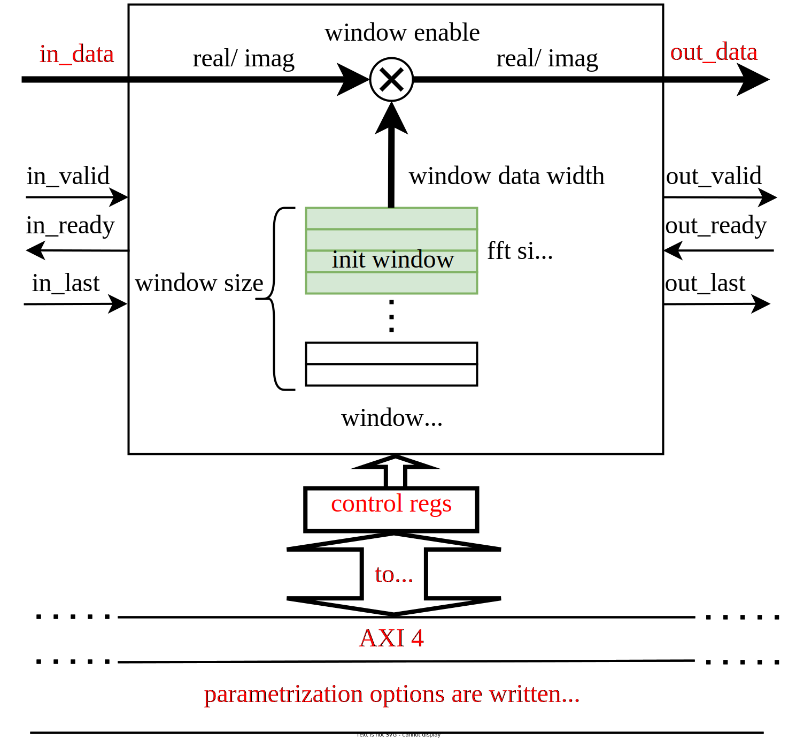

Streaming windowing function written in Chisel HDL
=======================================================

## Overview
This repository  contains streaming windowing function module written in [Chisel ](https://www.chisel-lang.org/) hardware design language. Windowing function is usually applied in digital signal processing prior to performing FFT to mitigate spectral leakage presentable inside frequency spectrum.
In the text below, module specification together with parameters definition and description of the interface are given.

### Windowing block

Module which implements continuous multiplication of the input samples with windowing coefficients is implemented as a AXI4 DSP Block with AXI4-stream input/output interface and AXI4 memory-mapped bus for configuring control registers and Windowing RAM.
Block diagram of the windowing function showing input/output signals, parameters of the core as well as control registers is depicted in the figure below.

 

Parameters are listed inside case class WindowingParams:

     case class WindowingParams [T <: Data] (
        	protoIQ : DspComplex[T],         // input data type
        	numPoints : Int, 		 // number of window coefficents
        	protoWin : T, 			 // window coefficients data type
        	decimType : DecimType,           // use DIT or DIF version, to know how to generate addresses for reading*
           	numMulPipes : Int,               // number of pipeline registers after multiplication operator
        	fftDirReg : Boolean,             // include register for defining fft direction (fft or ifft)/ when ifft is enabled passthrough data**
        	windowFunc : WindowFunctionType, // when constWindow is set then this parameter denotes constant window function
        	                                 // otherwise it represents window function used to initialize SRAM/Block RAM in run-time configurable mode***
        	memoryFile : String,             // name of the file where window coefficents are stored****
        	dirName    : String,             // directory name where file with windowing coefficents is saved
        	constWindow : Boolean            // if it is true, predefined window function stored in ROM is used, no SRAM/Block RAM
        )

\* Current version supports DIF variant of the FFT only or both DIF and DIT but assuming that bit-reverse logic is applied prior FFT block

\** While FFT generator supports both fft and ifft in ifft mode it is necessary to passtrough data, not supported in this moment

\*** This windowing block can provide following window functions used as init functions in run-time configurable mode or stored in ROM otherwise:
 * Hamming window
 * Hanning window
 * Blackman window
 * Triangular window
 * User specified - in this case user provides vector of window coefficients

Just to emphasize, those functions are forwarded to the core in floating point precision, inside the module coefficients are translated to their fixed-point representation using convergent rounding method.

\**** In run time configurable mode, file with windowing coefficients (name defined inside `memoryFile` string) is generated on the fly and that file is used for RAM initialization.

Previously explained module is described with following Scala files available inside`src/main/scala`  directory:

-   `WindowingParams.scala`  - defines parameters of the windowing module
-   `WindowFunc.scala`  - contains definition of various windowing functions
-   `WindowingBlock.scala`  - contains `WindowingBlock` wrapped as `AXI4DspBlock`

## Prerequisites

The following software packages should be installed prior to running this project:
* [sbt](http://www.scala-sbt.org)
* [Verilator](http://www.veripool.org/wiki/verilator)

## Tests

Besides main source code, some tests for windowing module are provided in this repository.

* `TesterUtil` -  contains useful functions for AXI4 stream data generation and tolerance checking
* `WindowingSpec` - contains simple test for `WindowingBlock` module. Test uses `AXI4MasterModel` and `AXI4StreamModel` for proper register/windowing RAM initialization and streaming transactions generation.

## TODO
* Check `numMulPipes` equal to zero and `constWindow` parameter is on true - fix that
* Consider to remove windowing blocks with single input and single output stream
* Update documentation
